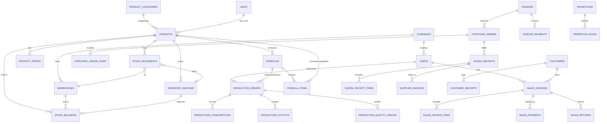

# Gudi Chemicals ERP — Database Design & Entity Relationships

## 1. Architectural Philosophy
The schema is normalized to 3NF where suitable, with deliberate immutable snapshots on financial documents (sales invoices, purchase invoices, production batches) to safeguard audit trails against subsequent changes to master records.

All monetary amounts and quantities use `DECIMAL(14, 4)` or `DECIMAL(12, 2)` to eliminate floating-point rounding errors.

---

## 2. Mermaid Entity Relationship Diagram

---

## 3. Core Database Tables & Columns

### 3.1 Company, Identity & Master Data
- `company_settings`: id, name, trade_name, gstin, pan, email, phone, address, state_code, state_name, currency_symbol, logo_path, financial_year_start, invoice_prefix, fy_code, created_at, updated_at.
- `users`: id, name, email, password, phone, role, is_active, last_login_at, remember_token, timestamps.
- `roles` & `permissions`: Standard Spatie RBAC tables (`roles`, `permissions`, `model_has_roles`, `role_has_permissions`, `model_has_permissions`).
- `warehouses`: id, code, name, address, is_primary, is_active, timestamps.
- `units`: id, name, code (e.g., LTR, KG, ML, GM, NOS, CAN, BTL), is_fractional, timestamps.
- `unit_conversions`: id, from_unit_id, to_unit_id, conversion_factor (e.g. 1 LTR = 1000 ML), timestamps.
- `product_categories`: id, name, slug, parent_id, is_active, timestamps.
- `hsn_codes`: id, code, description, gst_rate, timestamps.
- `products`:
  - `id`: BIGINT UNSIGNED AUTO_INCREMENT PRIMARY KEY
  - `sku`: VARCHAR(50) UNIQUE NOT NULL
  - `barcode`: VARCHAR(50) UNIQUE NULL
  - `name`: VARCHAR(255) NOT NULL
  - `category_id`: FK -> `product_categories`
  - `item_type`: ENUM('raw_material', 'semi_finished', 'finished_goods', 'packaging', 'trading', 'service')
  - `unit_id`: FK -> `units`
  - `hsn_code`: VARCHAR(20) NOT NULL
  - `gst_rate`: DECIMAL(5, 2) NOT NULL (e.g. 18.00)
  - `purchase_cost`: DECIMAL(14, 4) DEFAULT 0.0000
  - `retail_price`: DECIMAL(14, 4) DEFAULT 0.0000
  - `wholesale_price`: DECIMAL(14, 4) DEFAULT 0.0000
  - `min_selling_price`: DECIMAL(14, 4) DEFAULT 0.0000
  - `reorder_level`: DECIMAL(14, 4) DEFAULT 0.0000
  - `has_batch_tracking`: BOOLEAN DEFAULT TRUE
  - `has_expiry_tracking`: BOOLEAN DEFAULT FALSE
  - `is_active`: BOOLEAN DEFAULT TRUE
  - `image_path`: VARCHAR(255) NULL
  - `description`: TEXT NULL
  - `created_at`, `updated_at`, `deleted_at`

### 3.2 Inventory & Batch Ledger
- `inventory_batches`: id, product_id, batch_number, supplier_lot_number, mfg_date, expiry_date, retest_date, cost_per_unit, is_active, timestamps.
- `stock_balances`: id, product_id, warehouse_id, batch_id (nullable), quantity (DECIMAL 14,4), reserved_quantity (DECIMAL 14,4), timestamps, UNIQUE(product_id, warehouse_id, batch_id).
- `stock_movements`:
  - `id`: BIGINT UNSIGNED AUTO_INCREMENT PRIMARY KEY
  - `movement_date`: DATETIME NOT NULL
  - `product_id`: FK -> `products`
  - `warehouse_id`: FK -> `warehouses`
  - `batch_id`: FK -> `inventory_batches` (nullable)
  - `movement_type`: ENUM('purchase_receipt', 'purchase_return', 'production_consumption', 'production_output', 'sales_issue', 'sales_return', 'transfer_in', 'transfer_out', 'adjustment_add', 'adjustment_sub', 'opening_stock')
  - `reference_type`: VARCHAR(100) (e.g., App\Models\SalesInvoice)
  - `reference_id`: BIGINT UNSIGNED
  - `quantity`: DECIMAL(14, 4) NOT NULL (signed or absolute with direction)
  - `unit_cost`: DECIMAL(14, 4) NOT NULL
  - `balance_after`: DECIMAL(14, 4) NOT NULL
  - `notes`: TEXT NULL
  - `created_by`: FK -> `users`
  - `created_at`
- `stock_adjustments`: id, adjustment_number, warehouse_id, adjustment_date, reason, status, approved_by, created_by, timestamps.
- `stock_adjustment_items`: id, adjustment_id, product_id, batch_id, type ('add', 'subtract'), quantity, unit_cost, notes.

### 3.3 Purchasing & Vendors
- `vendors`: id, name, company_name, gstin, pan, phone, email, address, state_code, state_name, credit_period_days, opening_balance, current_balance, is_active, timestamps.
- `purchase_orders`: id, po_number, vendor_id, warehouse_id, order_date, expected_date, subtotal, tax_total, grand_total, status ('draft', 'approved', 'partial', 'received', 'cancelled'), approved_by, notes, timestamps.
- `purchase_order_items`: id, purchase_order_id, product_id, unit_id, quantity, received_quantity, unit_price, discount_amount, tax_rate, tax_amount, total_amount, timestamps.
- `goods_receipts`: id, grn_number, purchase_order_id (nullable), vendor_id, warehouse_id, receipt_date, supplier_challan_no, notes, status ('posted', 'cancelled'), received_by, timestamps.
- `goods_receipt_items`: id, goods_receipt_id, product_id, batch_number, mfg_date, expiry_date, quantity, unit_cost, timestamps.
- `supplier_invoices`: id, bill_number, supplier_invoice_no, goods_receipt_id, vendor_id, bill_date, due_date, subtotal, tax_amount, total_amount, paid_amount, status ('unpaid', 'partially_paid', 'paid'), timestamps.
- `vendor_payments`: id, payment_number, vendor_id, payment_date, amount, payment_method, reference_no, notes, created_by, timestamps.

### 3.4 Production & Formulation
- `formulas`: id, formula_code, product_id, name, version (INT), standard_batch_qty, output_unit_id, expected_yield_pct, process_loss_pct, is_approved, approved_by, notes, is_active, timestamps.
- `formula_items`: id, formula_id, ingredient_product_id, quantity, unit_id, wastage_pct, notes.
- `production_orders`:
  - `id`: BIGINT UNSIGNED AUTO_INCREMENT PRIMARY KEY
  - `batch_number`: VARCHAR(50) UNIQUE NOT NULL
  - `formula_id`: FK -> `formulas`
  - `output_product_id`: FK -> `products`
  - `target_warehouse_id`: FK -> `warehouses`
  - `planned_qty`: DECIMAL(14, 4) NOT NULL
  - `actual_qty`: DECIMAL(14, 4) DEFAULT 0.0000
  - `order_date`: DATE NOT NULL
  - `start_date`: DATETIME NULL
  - `completion_date`: DATETIME NULL
  - `status`: ENUM('draft', 'in_progress', 'qc_pending', 'completed', 'cancelled')
  - `formula_snapshot`: JSON NOT NULL (freezes formula specifications)
  - `total_material_cost`: DECIMAL(14, 4) DEFAULT 0.0000
  - `packaging_cost`: DECIMAL(14, 4) DEFAULT 0.0000
  - `overhead_cost`: DECIMAL(14, 4) DEFAULT 0.0000
  - `unit_production_cost`: DECIMAL(14, 4) DEFAULT 0.0000
  - `operator_id`: FK -> `users`
  - `approved_by`: FK -> `users`
  - `notes`: TEXT NULL
  - `timestamps`
- `production_consumptions`: id, production_order_id, product_id, batch_id, planned_qty, actual_consumed_qty, unit_cost, total_cost, timestamps.
- `production_quality_checks`: id, production_order_id, parameter_name (pH, Viscosity, Specific Gravity, Appearance), standard_specification, observed_value, is_passed, tested_by, remarks, timestamps.

### 3.5 POS & Sales Billing
- `customers`: id, customer_type ('retail', 'wholesale'), name, company_name, phone, email, gstin, pan, billing_address, shipping_address, state_code, state_name, credit_limit, opening_balance, current_balance, is_active, timestamps.
- `document_sequences`: id, document_type ('invoice', 'grn', 'po', 'batch', 'receipt', 'credit_note'), fy_code, prefix, current_number, updated_at.
- `sales_invoices`:
  - `id`: BIGINT UNSIGNED AUTO_INCREMENT PRIMARY KEY
  - `invoice_number`: VARCHAR(50) UNIQUE NOT NULL (e.g. GC/2026-27/0001)
  - `invoice_date`: DATE NOT NULL
  - `customer_id`: FK -> `customers`
  - `warehouse_id`: FK -> `warehouses`
  - `price_tier`: ENUM('retail', 'wholesale')
  - `is_interstate`: BOOLEAN DEFAULT FALSE
  - `place_of_supply`: VARCHAR(50) NOT NULL
  - `subtotal`: DECIMAL(14, 4) NOT NULL
  - `discount_total`: DECIMAL(14, 4) DEFAULT 0.0000
  - `taxable_amount`: DECIMAL(14, 4) NOT NULL
  - `cgst_amount`: DECIMAL(14, 4) DEFAULT 0.0000
  - `sgst_amount`: DECIMAL(14, 4) DEFAULT 0.0000
  - `igst_amount`: DECIMAL(14, 4) DEFAULT 0.0000
  - `rounding_adjustment`: DECIMAL(6, 2) DEFAULT 0.00
  - `grand_total`: DECIMAL(14, 2) NOT NULL
  - `paid_amount`: DECIMAL(14, 2) DEFAULT 0.00
  - `payment_status`: ENUM('unpaid', 'partially_paid', 'paid')
  - `status`: ENUM('draft', 'posted', 'cancelled')
  - `notes`: TEXT NULL
  - `created_by`: FK -> `users`
  - `timestamps`
- `sales_invoice_items`:
  - `id`: BIGINT UNSIGNED AUTO_INCREMENT PRIMARY KEY
  - `sales_invoice_id`: FK -> `sales_invoices`
  - `product_id`: FK -> `products`
  - `batch_id`: FK -> `inventory_batches` (nullable)
  - `product_name`: VARCHAR(255) NOT NULL
  - `sku`: VARCHAR(50) NOT NULL
  - `hsn_code`: VARCHAR(20) NOT NULL
  - `quantity`: DECIMAL(14, 4) NOT NULL
  - `unit_id`: FK -> `units`
  - `unit_price`: DECIMAL(14, 4) NOT NULL
  - `discount_amount`: DECIMAL(14, 4) DEFAULT 0.0000
  - `taxable_amount`: DECIMAL(14, 4) NOT NULL
  - `gst_rate`: DECIMAL(5, 2) NOT NULL
  - `cgst_rate`: DECIMAL(5, 2) DEFAULT 0.00
  - `cgst_amount`: DECIMAL(14, 4) DEFAULT 0.0000
  - `sgst_rate`: DECIMAL(5, 2) DEFAULT 0.00
  - `sgst_amount`: DECIMAL(14, 4) DEFAULT 0.0000
  - `igst_rate`: DECIMAL(5, 2) DEFAULT 0.00
  - `igst_amount`: DECIMAL(14, 4) DEFAULT 0.0000
  - `line_total`: DECIMAL(14, 4) NOT NULL
  - `is_free_item`: BOOLEAN DEFAULT FALSE
  - `cost_price`: DECIMAL(14, 4) DEFAULT 0.0000 (for COGS)
- `sales_payments`: id, sales_invoice_id, customer_id, payment_date, amount, payment_method ('cash', 'upi', 'card', 'bank_transfer', 'credit'), reference_no, received_by, timestamps.
- `sales_returns`: id, return_number, sales_invoice_id, customer_id, return_date, refund_amount, status ('approved', 'pending'), created_by, timestamps.
- `sales_return_items`: id, sales_return_id, product_id, batch_id, return_qty, condition ('saleable', 'damaged'), refund_unit_price, line_total.

### 3.6 Promotions & Discounts
- `promotions`: id, name, code, type ('bogo', 'b2g1', 'bxgy', 'percent_discount', 'flat_discount', 'combo', 'slab'), start_date, end_date, is_active, min_order_value, priority, timestamps.
- `promotion_rules`: id, promotion_id, buy_product_id, buy_qty, get_product_id, get_qty, discount_pct, discount_flat, customer_type, conditions_json.

### 3.7 Expenses & Notification Logs
- `expense_categories`: id, name, description, timestamps.
- `expenses`: id, expense_number, expense_category_id, expense_date, amount, payment_method, paid_to, receipt_voucher_path, notes, created_by, timestamps.
- `notification_logs`: id, channel ('whatsapp', 'email'), recipient, reference_type, reference_id, status ('queued', 'sent', 'failed'), provider_message_id, error_message, payload_snapshot, timestamps.
